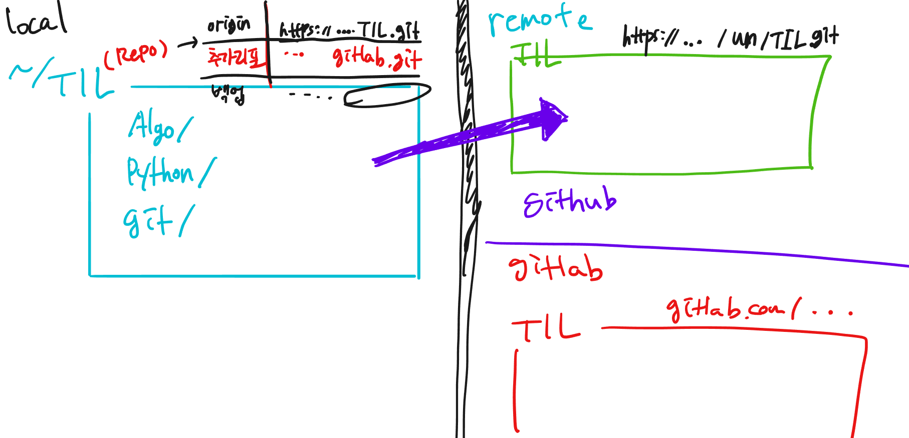

# Github 특강  (20/12/22)

## git 이란?

버전을 관리하는 것

**git hub** 와의 차이점 : git을 업로드할 수 있는 클라우드


## git 설치

 git-scm.com 에서 다운로드


## git 사용법

### 초기화

```
$ git init
```

초기화를 하게되면 (master)가 붙으며 리포로 설정된다.


만약 리포를 해제하려면 

```
$ rm -rf. git
```

하지만 최대한 사용할 일이 없었으면 한다.


### 최초 설정

처음 컴퓨터에 git 설치하면, 사용자의 이메일과 이름을 적어준다. 이는 앞으로 일어나는 커밋에 서명을 하기 위해 필요하다.

```
$git config --global user.name"<이름>"

$git config --global user.email"<이메일> 
```


잘 설정되었나 확인하려면

```
$ git config user.name
이름 출력

$ git config user.email
이메일 출력
```


### 상태 점검

```
$ git status
```

습관화 하는 것이 좋은 명령어


변경사항이 있을 때 

- 빨간색 : 스테이지에 없을 때
- 초록색 : 스테이지에 있을 때


### 커밋

1. 스테이지 올리기

   ```
   $ git add . #수정된 전체 파일
   
   $ git add 파일명1 파일명2 #일부 파일
   ```

    

2. 커밋

   ```
   $ git commit -m '메시지'
   ```

   메시지를 사용하는 이유 : 수정사항을 명확히 명시하기 위해

### 원격 저장소

1. github 홈페이지에서 'new repository'

2. ```
   $ git remote add origin https://~ #origin은 저장소의 이름
   $ git remote -v #원격저장소 확인
   
   $ git push origin master 
   로그인 팝업창이 뜨고 저장이 완료됨
   ```



### 그 외 명령어

- 로그 보기

  ```
  $ git log
  ```

  

- 스테이지 내리기

  ```
  $ git restore --staged '파일명'
  ```


### Summary

| 명령어       | 설명                                    |
| ------------ | --------------------------------------- |
| `git init`   | 빈 디렉토리를 git 저장소로 초기화 한다. |
| `git status` | 현재 git 상태를 확인한다.               |
| `git add`    | 커밋할 파일을 stage에 올린다.           |
| `git commit` | 변경 사항을 기록한다.                   |
| `git log`    | 커밋 내역을 확인한다.                   |


## 터미널 사용법

| 명령어 | 설명                   |
| ------ | ---------------------- |
| ls     | 리스트                 |
| ls -a  | 숨겨진 리스트까지 확인 |
| mkdir  | 폴더 만들기            |
| touch  | 파일 만들기            |
| cd     | 원하는 폴더로 이동     |
| cd ..  | 상위 폴더로 이동       |
| cd ~   | 홈 디렉토리로 이동     |

