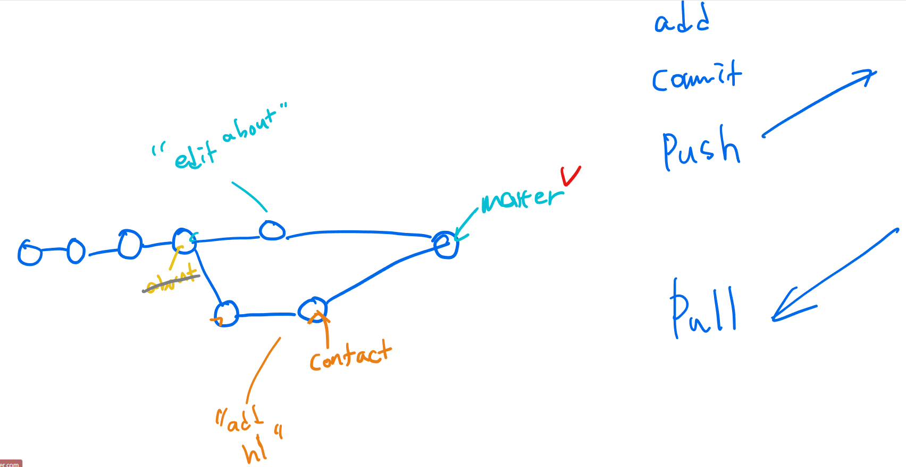
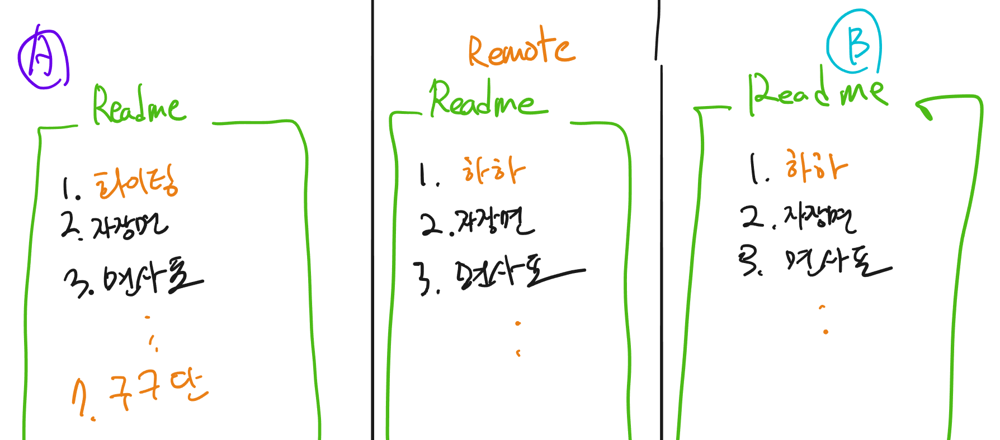
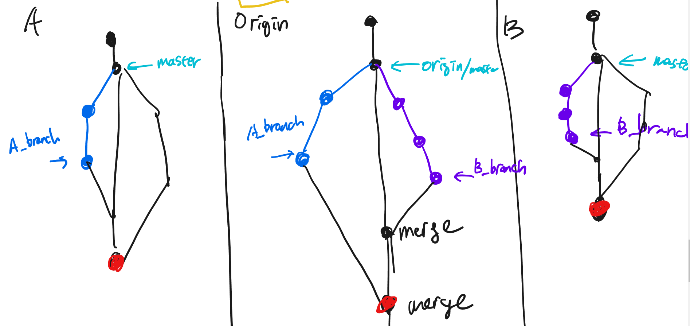

# Github 특강 2 (20/12/23)

## 1. 커밋 메시지 수정하기

```
$ vim

#단축키 i : 삽입
#ESC : 삽입 종료 후 명령어 입력
#단축키 wq : 저장후 창 닫기
```


## 2. Branch 추가하여 관리하기

```
$ git branch <name> #추가

$ git branch -d <name> #삭제

$ git switch <name> #변경

$ git merge <name> #master에 병합
```




## 3. github으로 협엽하기

```
$ git clone <리포 주소> #홈에서 실행하기

$ git push origin master
$ git pull origin master 
```



![image-20201228093952727](intermediate.assets/image-20201228093952727.png


### 협업시 branch를 나눠야 하는 이유

- git이 수정되었을 경우 master가 승인해주어야 merge가 성립된다.
- 개발자가 많고 프로젝트가 클 경우 기능별로 코딩 후 합치는 작업이 필요하다.


**pull 할 때는 꼭 branch를 master로 바꾼 뒤 실행**


